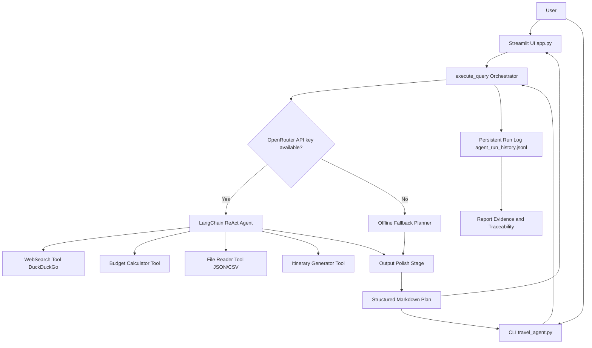

# Architecture Diagram (Travel Planner Agent)

```mermaid
flowchart TD
    U[User] --> UI[Streamlit UI app.py]
    U --> CLI[CLI travel_agent.py]

    UI --> ORCH[execute_query Orchestrator]
    CLI --> ORCH

    ORCH --> LLM{OpenRouter API key available?}
    LLM -->|Yes| REACT[LangChain ReAct Agent]
    LLM -->|No| FB[Offline Fallback Planner]

    REACT --> T1[WebSearch Tool DuckDuckGo]
    REACT --> T2[Budget Calculator Tool]
    REACT --> T3[File Reader Tool JSON/CSV]
    REACT --> T4[Itinerary Generator Tool]

    REACT --> POLISH[Output Polish Stage]
    FB --> POLISH

    POLISH --> OUT[Structured Markdown Plan]
    OUT --> UI
    OUT --> CLI

    ORCH --> LOG[Persistent Run Log agent_run_history.jsonl]
    LOG --> EVID[Report Evidence and Traceability]
```
