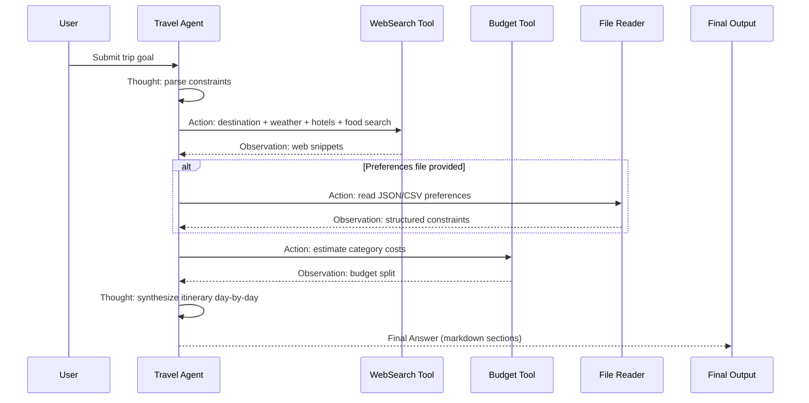

# Tool Flow Diagram (ReAct Execution)

```mermaid
sequenceDiagram
    participant User
    participant Agent as Travel Agent
    participant Search as WebSearch Tool
    participant Budget as Budget Tool
    participant File as File Reader
    participant Output as Final Output

    User->>Agent: Submit trip goal
    Agent->>Agent: Thought: parse constraints
    Agent->>Search: Action: destination + weather + hotels + food search
    Search-->>Agent: Observation: web snippets

    alt Preferences file provided
        Agent->>File: Action: read JSON/CSV preferences
        File-->>Agent: Observation: structured constraints
    end

    Agent->>Budget: Action: estimate category costs
    Budget-->>Agent: Observation: budget split

    Agent->>Agent: Thought: synthesize itinerary day-by-day
    Agent-->>Output: Final Answer (markdown sections)
```
